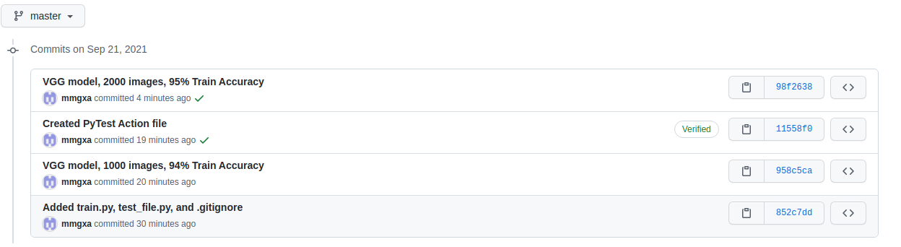
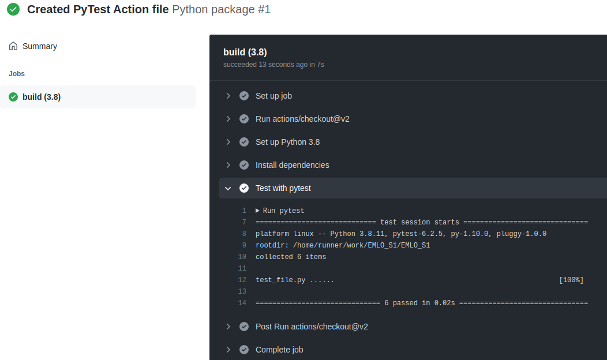

# EMLO Session 1

The objective of this class was to convert a Tensorflow model into PyTorch. Git/DVC are used for versioning.

# Evaluation per Class

We are required to calculate the accuracy for each class. A function was written to acheive this.

```python
def scorepro(targets, predictions):
        
    TP = torch.sum(  targets[targets==1] == predictions[targets==1] )
    TN = torch.sum(  targets[targets==0] == predictions[targets==0] )
    FP = torch.sum(  targets[targets==1] == predictions[targets==0] )
    FN = torch.sum(  targets[targets==0] == predictions[targets==1] )

    c1_acc = TP / (TP + FN)
    c0_acc = TN / (TN + FP)

    return c0_acc.item()*100, c1_acc.item()*100
```

# Dataset

The `torchvision.datasets` has a module called `ImageFolder` that can read images from a directory (provided a definite structure is present) and automatically assign them classes.

```python
train_data = datasets.ImageFolder(TRAIN_PATH, transform=img_transforms)
val_data = datasets.ImageFolder(TEST_PATH, transform=img_transforms)
```

To find which label has been assigned to each class, we can run the following code

```python
print(train_data.class_to_idx)
```

The training loop has been written using PyTorch Lightning.

# Model
The model used was a pretrained VGG16. All layers (except) for the batch normalization layers were 'frozen' (i.e. made untrainable) since the VGG16 has been trained on images.

However, it has 1000 output classes. We changed this last layer to output for 2 classes (cats and dogs) in our case.


```python
from torchvision import models

pretrained_vgg16 = models.vgg16(pretrained=True)

for name, param in pretrained_vgg16.named_parameters():
    if("bn" not in name):
        param.requires_grad = False

num_features = pretrained_vgg16.classifier[6].in_features
pretrained_vgg16.classifier[6] = nn.Linear(in_features=num_features, out_features=2)
```

# Epochs

Unlike the problem statement, the model was trained only for one epoch, because
- the model has already been heavily trained on similar data.
- only the last layer is trained; the previous ones are frozen
- even one epoch results in greater than 98% accuracy which is sufficient
- on my non-gpu system, each epoch took 10 minutes :(


# Steps 

After entering the virtual environment created for the assignment and installing the required dependencies, the following commands were executed in the shell.

```
git clone https://github.com/mmgxa/EMLO_S1
cd EMLO_S1
git remote set-url origin git@github.com:mmgxa/EMLO_S1.git
git config user.name "____"
git config user.email "______"
(copy train.py, test_file.py, and .gitignore)
git add train.py test_file.py .gitignore
git commit -m "Added train.py, test_file.py, and .gitignore"
git push

dvc get https://github.com/iterative/dataset-registry tutorials/versioning/data.zip
unzip -q data.zip
rm -f data.zip
dvc init
dvc add data

python3 train.py
dvc add model.ckpt
git add data.dvc model.ckpt.dvc metrics.csv .gitignore
git commit -m "VGG model, 1000 images, 94% Train Accuracy"
git tag -a "v1.0" -m "VGG model, 1000 images, 94% Train Accuracy"
git status
git push

[Add pytest file here]

git pull
dvc get https://github.com/iterative/dataset-registry tutorials/versioning/new-labels.zip
unzip -q new-labels.zip
rm -f new-labels.zip
rm -f model.ckpt model.ckpt.dvc

dvc add data
python3 train.py
dvc add model.ckpt
git add data.dvc model.ckpt.dvc metrics.csv .gitignore
git commit -m "VGG model, 2000 images, 95% Train Accuracy"
git tag -a "v2.0" -m "VGG model, 2000 images, 95% Train Accuracy"
git status
git push

```


# Training Results

| Data | Train Acc  | Val Acc | Cat Acc | Dog Acc |
| --- | ------ | ---- | ------ | ----- |
| 1000 Images | 94%  | 98%  | 98% | 98%
| 2000 Images | 95%  | 99%  | 98% | 99%

The training results have been written to a `metrics.csv` file.

# Testing 

A `test_file.py` was created that ensures the following condiitons

- you must publish metrics.csv file

```python
def test_metrics_exists():
    assert os.path.isfile("metrics.csv"), "metrics.csv file is missing!"
```

- you have NOT uploaded data (check where it is expected)
```python
def test_data_exists():
    assert os.path.isdir("data")==False, "data directory must not be uploaded!"
```

- you have NOT uploaded model.ckpt file (check where it is expected)
```python
def test_model_exists():
    assert os.path.isfile("model.ckpt")==False, "model.ckpt must not be uploaded!"
```

- your accuracy of the model is more than 70% (read from metrics)

```python
def test_val_acc():
    with open('metrics.csv') as file:
        props = dict(line.strip().split('=', 1) for line in file)
    assert int(props['ValAcc']) > 70, "Accuracy of Validation Set must be greater than 70%"
```

- the accuracy of your model for cat and dog is independently more than 70% (read from metrics.csv file)

```python
def test_cat_acc():
    with open('metrics.csv') as file:
        props = dict(line.strip().split('=', 1) for line in file)
    assert int(props['CatAcc']) > 70, "Accuracy of Cat Class must be greater than 70%"

def test_dog_acc():
    with open('metrics.csv') as file:
        props = dict(line.strip().split('=', 1) for line in file)
    assert int(props['DogAcc']) > 70, "Accuracy of Dog Class must be greater than 70%"
```

# Screenshots

### Commit History (excluding README.md/images)


### PyTest After Training on 1000 Images


### PyTest After Training on 2000 Images

